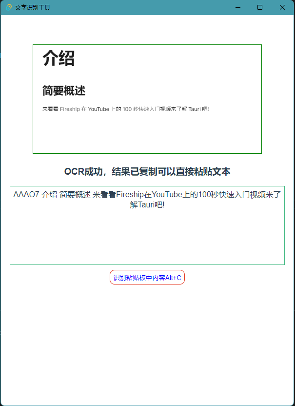
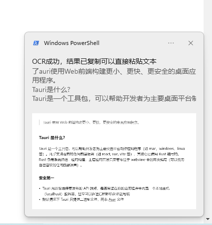

# ocr_tauri

## 使用tauri+tesseract制作OCR工具

1. 快速识别
2. 本地应用不联网
3. ALT+C 全局快捷键直接识别剪贴板中的图片内容

### 使用截图








### 依赖说明

1. serd json数据
2. tauri 开发框架
3. clipborad-win 剪贴板管理
4. winrt-notification windows消息提醒
5. futures 异步编程库
6. image 图片处理库
7. imageproc 图片处理库
8. tesseract 图片识别库
9. platform-dirs 平台目录 

```
serde_json = "1.0"
serde = { version = "1.0", features = ["derive"] }
tauri = { version = "1.0.3", features = ["api-all", "system-tray"] }
clipboard-win="4.4.1"
winrt-notification = "0.5.1"
futures = "0.3"
image = "0.24"
imageproc = "0.23"
tesseract ="0.12"
platform-dirs = "0.3.0"
```
