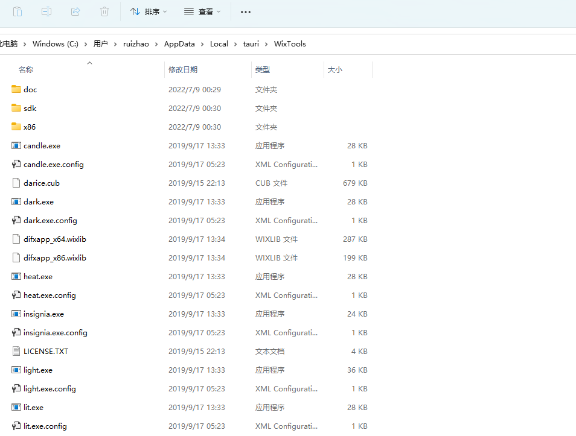
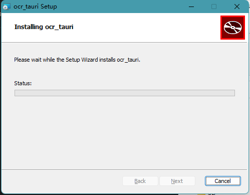

# ocr_tauri

## 使用tauri+tesseract制作OCR工具


功能
- [x] 快速识别
- [x] 本地应用不需要联网识别
- [x] 全局快捷键直接识别剪贴板中的图片内容
- [x] 配置文件个性化配置快捷键和使用模式
- [x] 资源文件一块打包安装
- [x] 限制一个实例运行
- [x] 双击系统托盘图标切换窗口显示状态
- [ ] 自动更新

### 配置说明

```config/app.json```

1. __shortcut_key__: 快捷键 默认ALT+C
2. __notification__: 显示通知 默认true
3. __showWindowOn__: 显示程序窗口 默认false
4. __web__: web服务端口，默认9999，小于等于0表示不启用web服务

推荐日常使用不显示窗口，仅显示通知的模式，不干扰正常工作。


### 使用截图


### 依赖说明

1. serd json数据
2. tauri 开发框架
3. clipborad-win 剪贴板管理
4. winrt-notification windows消息提醒
5. futures 异步编程库
6. image 图片处理库
7. imageproc 图片处理库
8. tesseract 图片识别库
9. platform-dirs 平台目录 
10. config 配置文件
11. tauri-plugin-single-instance 单实例插件

```
serde_json = "1.0"
serde = { version = "1.0", features = ["derive"] }
tauri = { version = "1.0.3", features = ["api-all", "system-tray"] }
clipboard-win="4.4.1"
winrt-notification = "0.5.1"
futures = "0.3"
image = "0.24"
imageproc = "0.23"
tesseract ="0.12"
platform-dirs = "0.3.0"
config = "0.13.1"
tpsi = {git = "http://github.com/amrbashir/tauri-plugin-single-instance", branch = "master" , package="tauri-plugin-single-instance"}
```


### 构建说明

因为依赖 leptonica-sys 和 tesseract-sys 只是对应 C/C++ 库的封装，所以我们需要对应的 C/C++ 库。
vcpkg 安装及使用参考：https://github.com/microsoft/vcpkg/#quick-start-windows

```
vcpkg install leptonica:x64-windows-static-md
vcpkg install tesseract:x64-windows-static-md
```

执行`npm run tauri build` 会下载wix311-binaries 很慢可以用浏览器下载然后解压到`~\AppData\Local\tauri\WixTools`目录下



最终构建的文件会放到 `项目目录\target\release\bundle/msi/ocr_tauri_0.1.0_x64_en-US.msi` 


